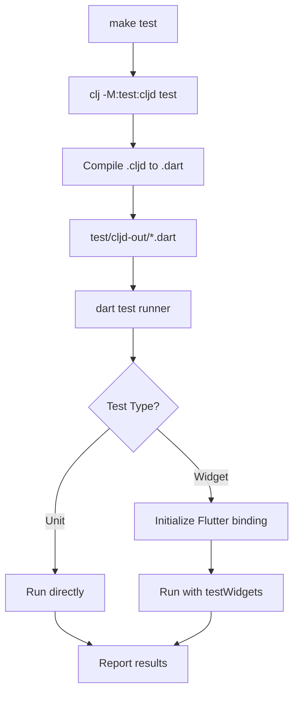
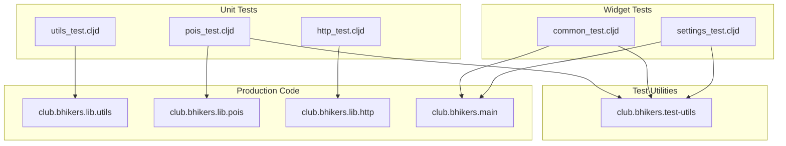

# Design Document: Test Suite Refactoring

## Overview

This design document outlines the architecture and implementation approach for refactoring the BHikers Club test suite. The refactoring consolidates test utilities, standardizes test organization, and establishes consistent patterns for both unit tests and widget tests in ClojureDart/Flutter.

## Architecture

### Current State

```
src/
├── club/bhikers/screens/
│   ├── commontest.cljd      ← Widget test (wrong location)
│   └── settingstest.cljd    ← Widget test (wrong location)
test/
├── club/bhikers/lib/
│   ├── http_test.cljd       ← Unit test
│   ├── pois_test.cljd       ← Unit test with mocks
│   └── utils_test.cljd      ← Unit test
```

### Target State

```
test/
├── club/bhikers/
│   ├── test_utils.cljd      ← NEW: Shared test utilities
│   ├── lib/
│   │   ├── http_test.cljd
│   │   ├── pois_test.cljd
│   │   ├── utils_test.cljd
│   │   ├── state_test.cljd  ← NEW: State tests
│   │   └── config_test.cljd ← NEW: Config tests
│   └── screens/
│       ├── common_test.cljd ← MOVED from src/
│       └── settings_test.cljd ← MOVED from src/
```

## Components and Interfaces

### 1. Test Utilities Module (`club.bhikers.test-utils`)

```clojure
(ns club.bhikers.test-utils
  (:require ["package:flutter/material.dart" :as m]
            ["package:flutter_test/flutter_test.dart" :as ft]
            ["package:shared_preferences/shared_preferences.dart" :refer [SharedPreferences]]
            [club.bhikers.lib.app :as app]
            [club.bhikers.lib.logging :as logging]
            [club.bhikers.lib.overpassapi :as oapi]
            [cljd.flutter :as f]))

;; ============================================
;; Test Environment Initialization
;; ============================================

(defn init-test-env!
  "Initializes the Flutter test binding and mock systems.
   Must be called before any widget test."
  []
  (m/WidgetsFlutterBinding.ensureInitialized)
  (-> SharedPreferences (.setMockInitialValues {}))
  (await (logging/init! :mock-mode? true))
  (await (app/init! :mock-mode? true)))

;; ============================================
;; Mock Factories
;; ============================================

(defn mock-overpass-api
  "Creates a mock Overpass API that returns the given data."
  [return-value]
  (reify oapi/disposable-overpass-api
    (dispose! [this] this)
    (query [this type lat lon osm-tags radius]
      (Future.value return-value))))

;; ============================================
;; Widget Test Helpers
;; ============================================

(defn with-test-app
  "Wraps a widget for testing with optional dependency overrides.
   Includes EasyLocalization setup for widgets that require translations.
   
   Usage:
   (with-test-app (MyWidget) :overrides {:overpass-api mock-api})
   
   Note: When testing with BhikersClubApp, localization is already included,
   so this wrapper is mainly for testing individual screens in isolation."
  [widget & {:keys [overrides] :or {overrides {}}}]
  (f/widget
    :bind overrides
    (el/EasyLocalization
      .supportedLocales [(Locale "en")]
      .path "src/resources/langs"
      .fallbackLocale (Locale "en"))
    (m/MaterialApp .home widget)))

(defn pump-and-settle!
  "Pumps a widget and waits for all animations to settle.
   Returns the tester for chaining."
  [^ft/WidgetTester tester widget]
  (let [{:flds [pumpWidget pumpAndSettle]} tester]
    (await (pumpWidget widget))
    (await (pumpAndSettle))
    tester))

(defn open-drawer!
  "Opens the scaffold drawer with proper type hints to avoid dynamic warnings."
  [^ft/WidgetTester tester]
  (let [{:flds [firstState pumpAndSettle]} tester
        ^m/ScaffoldState scaffold-state (#/(firstState m/ScaffoldState) 
                                          (ft/find.byType m/Scaffold))]
    (.openDrawer scaffold-state)
    (await (pumpAndSettle))))

(defn tap-widget!
  "Taps a widget found by the given finder and settles."
  [^ft/WidgetTester tester finder]
  (let [{:flds [tap pumpAndSettle]} tester]
    (await (tap finder))
    (await (pumpAndSettle))))
```

### 2. Widget Test Pattern

```clojure
;; Before (current pattern - verbose)
(deftest aboutversiontest
  :tags [:widget]
  :runner (ft/testWidgets [tester])
  (do
    (await (app/init! :mock-mode? true))
    (await (logging/init! :mock-mode? true))
    (let [^ft/WidgetTester {:flds [pumpWidget pumpAndSettle firstState tap]} tester
          _ (await (pumpWidget (BhikersClubApp "/settings")))
          _ (await (pumpAndSettle))
          _ (await (-> (ft/find.byType m/Scaffold)
                       (#/(firstState m/ScaffoldState))
                       .openDrawer))  ;; DYNAMIC WARNING HERE
          _ (await (pumpAndSettle))
          _ (await (tap (ft/find.byType m/AboutListTile)))
          _ (await (pumpAndSettle))]
      (ft/expect (ft/find.text (get @state/app-info :app-name)) ft/findsOneWidget))))

;; After (refactored pattern - concise)
(deftest about-version-test
  :tags [:widget]
  :runner (ft/testWidgets [tester])
  (do
    (await (tu/init-test-env!))
    (tu/pump-and-settle! tester (BhikersClubApp "/settings"))
    (tu/open-drawer! tester)
    (tu/tap-widget! tester (ft/find.byType m/AboutListTile))
    (ft/expect (ft/find.text (get @state/app-info :app-name)) ft/findsOneWidget)))
```

### 3. Unit Test Pattern (unchanged, already good)

```clojure
(deftest str->int-test
  (testing "str->int converts valid string within bounds"
    (is (= 5 (utils/str->int "5" 0 10))))
  
  (testing "str->int returns nil for non-numeric string"
    (is (nil? (utils/str->int "abc" 0 10)))))
```

## Data Models

### Test Configuration

The test suite uses `deps.edn` aliases for configuration:

```clojure
;; deps.edn
{:aliases
 {:test {:extra-paths ["test"]}
  :test-widgets {:extra-paths ["test"]
                 :cljd/opts {:dart-test-args ["-t" "widget"]}}}}
```

### Mock Data Structures

Mock objects follow the existing protocol-based pattern from `pois_test.cljd`:

```clojure
;; Mock POI data structure
{"type" "node"
 "id" 123
 "lat" 40.0
 "lon" 10.0
 "tags" {"amenity" "cafe"}
 "poi-type" "cafe"}  ;; Injected by fetch-pois-by-type
```

## Error Handling

### Test Failures

- Widget tests use `ft/expect` with matchers like `ft/findsOneWidget`, `ft/findsNothing`
- Unit tests use `is` assertions with descriptive `testing` blocks
- Async operations use `await` and propagate exceptions naturally

### Dynamic Warning Prevention

All widget interactions must use explicit type hints:

```clojure
;; WRONG - causes dynamic warning
(-> finder (#/(firstState m/ScaffoldState)) .openDrawer)

;; CORRECT - explicit type hint
(let [^m/ScaffoldState state (#/(firstState m/ScaffoldState) finder)]
  (.openDrawer state))
```

## Testing Strategy

### Test Categories

| Category | Location | Tag | Runner |
|----------|----------|-----|--------|
| Unit Tests | `test/club/bhikers/lib/` | none | default |
| Widget Tests | `test/club/bhikers/screens/` | `:widget` | `ft/testWidgets` |

### Running Tests

```bash
# All tests
make test
# or: clj -M:test:cljd test

# Widget tests only
clj -M:test-widgets:cljd test

# Specific namespace
clj -M:test:cljd test club.bhikers.lib.utils-test
```

### Test Naming Conventions

| Type | Pattern | Example |
|------|---------|---------|
| Unit Test | `<function-name>-test` | `str->int-test` |
| Widget Test | `<screen>-<behavior>-test` | `settings-title-display-test` |

## Mermaid Diagrams

### Test Execution Flow



### Test Module Dependencies



## Migration Steps

1. Create `test/club/bhikers/test_utils.cljd` with shared utilities
2. Move `src/club/bhikers/screens/commontest.cljd` → `test/club/bhikers/screens/common_test.cljd`
3. Move `src/club/bhikers/screens/settingstest.cljd` → `test/club/bhikers/screens/settings_test.cljd`
4. Update namespaces in moved files
5. Refactor widget tests to use shared utilities
6. Fix dynamic warning with proper type hints
7. Rename tests to follow conventions
8. Remove `SharedPreferences.setMockInitialValues` from `app.cljd` (move to test-utils)
9. Verify all tests pass with `make test`
